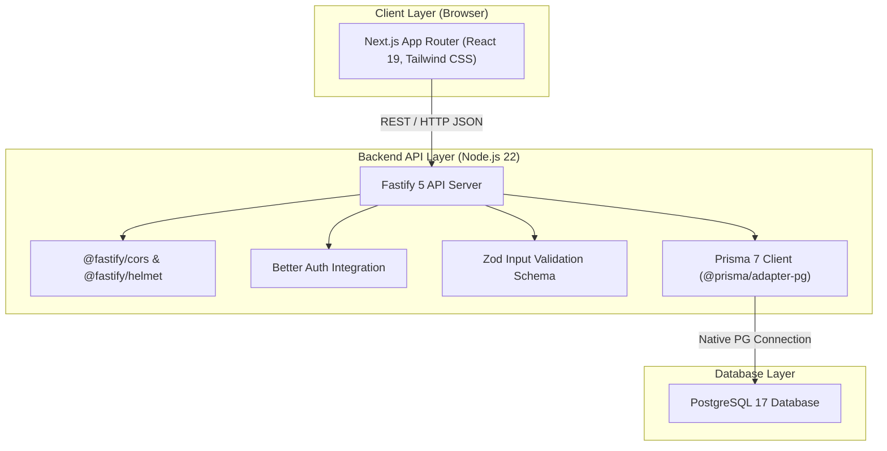
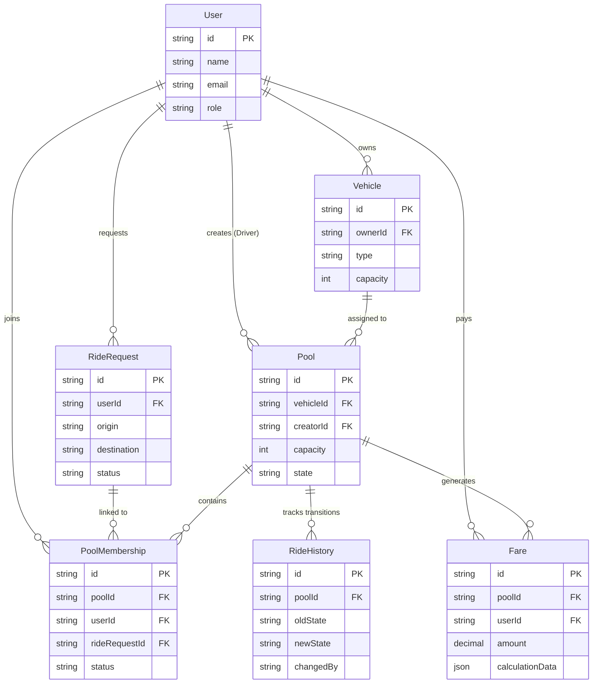

# Dhaka Tesla Pool System

> **"Share a seat. Split the fare. Survive Dhaka traffic."**

Dhaka Tesla Pool is a full-stack ride-pooling platform designed around Dhaka's urban mobility use case. The system pairs passengers along overlapping traffic corridors (e.g. Banani Road 11 to Mohakhali / Gulshan 1) into shared three-seater electric vehicles while enforcing seat capacity, transparent individual fare calculation, and explicit ride state lifecycles.


---

## The Banani Rush-Hour Story & Demo Cast

It's 8:41 AM on Banani Road 11. **Jashim** is ready in **Bullet**, his battery-powered 3-seat electric Tesla vehicle. 

- **Nusrat** requests a ride from **Banani Road 11 to Mohakhali**.
- **Rafiq** requests a matching trip from **Banani Road 11 to Gulshan 1**.
- The system automatically matches Nusrat and Rafiq into Bullet's pool (2 of 3 seats occupied), applying a 20% shared pool discount to both fares.
- **Shirin** attempts to book the 3rd seat from **Banani Road 11 to Farmgate**.
- When a 4th passenger attempts to join, the backend rejects the request with a `409 POOL_FULL` error, preserving Bullet's strict 3-seat capacity limit.


---

## System Architecture



---

## Entity Relationship Diagram (ERD)


---
## Repository Structure

```text
tesla-ride-pool/
├── apps/
│   ├── api/                 # Fastify backend
│   │   ├── src/
│   │   │   ├── modules/     # Feature-based backend modules
│   │   │   ├── middleware/
│   │   │   ├── plugins/
│   │   │   └── routes/
│   │   ├── prisma/          # Schema, migrations and seed
│   │   └── generated/       # Generated Prisma client
│   │
│   └── web/                 # Next.js frontend
│
├── docker-compose.yml       # PostgreSQL + API + Web
├── pnpm-workspace.yaml      # Monorepo workspace configuration
└── package.json
```

---

## Fare Calculation & Monetary Storage Rationale

### 1. Fare Model Formula
Every pooled passenger receives an individual, transparent fare calculated using:

`passengerFare = baseFare + distanceCharge - poolDiscount`

- **Base Fare**: 80 BDT
- **Distance Charge**: 40 to 60 BDT (based on zone distance e.g. Banani to Mohakhali = 60, Banani to Gulshan 1 = 40)
- **Pool Discount**: 20% discount on total trip price when sharing a ride in Bullet

### 2. Monetary Storage: Integer Poysha vs Decimal
We store money in integer **Poysha / Paisa** (1 BDT = 100 Poysha) in backend calculations:
- **Why?** IEEE 754 floating-point arithmetic (e.g. `0.1 + 0.2 = 0.30000000000000004`) causes accumulative rounding errors in financial ledgers.
- Storing total as `11200 Poysha` ensures exact integer math during payment splitting, fare refunds, and driver payout aggregation without fractional loss.

---

## Ride Lifecycle & Concurrency Control

### State Transition Machine
```text
[REQUESTED] --> [MATCHED/ACCEPTED] --> [DRIVER_ARRIVED] --> [STARTED] --> [COMPLETED]
     |                   |                      |                 |
     +-------------------+----------------------+-----------------+--> [CANCELLED]
```
Invalid transitions (e.g. `COMPLETED` -> `STARTED`) are rejected with `400 AppError (INVALID_STATE_TRANSITION)`.

### Concurrency & Capacity Enforcement

Pool membership creation is performed inside a Prisma database transaction.

Before adding a passenger, the API validates the pool's current membership count against its configured seat capacity. If the pool has already reached capacity, the request is rejected with:

`409 POOL_FULL`

For example, with Bullet's 3-seat capacity:

* Nusrat → seat 1
* Rafiq → seat 2
* Shirin → seat 3
* Additional passenger → `409 POOL_FULL`

This keeps the capacity rule enforced at the backend rather than relying only on frontend validation.


---

## Technology Choices & Justification

| Layer / Tool | Selected Choice | Realistic Alternatives | Engineering Rationale |
| :--- | :--- | :--- | :--- |
| **Backend** | Fastify 5 + Node.js 22 | Express, NestJS | High HTTP throughput, lower latency overhead, low memory footprint suitable for real-time ride matching. |
| **Database** | PostgreSQL 17 | MongoDB, MySQL | Relational integrity, ACID transaction support required for seat capacity concurrency and foreign key constraints. |
| **ORM** | Prisma 7.10 | TypeORM, Drizzle | Type-safe query builder, auto-generated TypeScript types, native pg adapter integration. |
| **Frontend** | Next.js 15 (App Router) | React + Vite | Server/Client components, built-in routing, fast SSR/SSG compilation for passenger & driver dashboards. |
| **Validation** | Zod 4 | Yup, Joi | TypeScript-first schema inference seamlessly shared between HTTP handlers and services. |
| **Testing** | Vitest 5 | Jest | Ultra-fast ESM-native test runner with instant hot-module re-execution. |

---

## Quick Start & Setup Instructions

### Prerequisites
- Node.js >= 22.x
- pnpm >= 10.x
- Docker & Docker Compose

### 1. Run with Docker Compose (Recommended)
```bash
# Clone and build containers
docker compose up --build
```
- Web UI: `http://localhost:3000`
- API Health Check: `http://localhost:4000/health`

### 2. Manual Local Setup
```bash
# Install dependencies
pnpm install

# Setup environment
cp .env.example .env

# Run database migration & seed story cast
cd apps/api
pnpm prisma migrate dev
pnpm prisma db seed

# Run backend API
pnpm run dev

# Run frontend web (in root or apps/web)
cd ../web
pnpm run dev
```

### 3. Run Test Suite
```bash
cd apps/api
pnpm run test
```

---

## AI Usage Disclosure

AI-assisted development tools were used during the design, implementation, debugging, and documentation of this project.

### AI-Assisted Contributions

* Assisted with code implementation, refactoring, debugging, and troubleshooting across the backend and frontend.
* Used AI assistance when evaluating technical approaches, including Prisma 7 database integration and PostgreSQL configuration.
* Used AI assistance to review and improve project documentation, test cases, Docker configuration, and development workflows.
* The final implementation, technical decisions, modifications, and acceptance of generated suggestions were reviewed and controlled by the developer.

### Developer Decisions and Modifications

* Rejected generic seed-data templates such as `user1`, `driver1`, and `vehicle1`.
* Enforced the project's defined story cast — **Jashim**, **Bullet**, **Nusrat**, **Rafiq**, and **Shirin** — across seed data, test fixtures, and frontend interactive personas.
* Chose integer **Poysha** representation for monetary calculations to avoid floating-point rounding issues.
* Reviewed and modified AI-generated suggestions to align with the project's requirements and architecture.


---

## 6-Minute Video Presentation Structure

- **0:00 - 1:00**: Problem introduction & Dhaka shared ride-pooling concept.
- **1:00 - 3:00**: Technical Architecture, ERD walkthrough, fare formula derivation, state machine & concurrency transaction locking.
- **3:00 - 6:00**: Live product tour — Passenger request flow (Nusrat & Rafiq), Driver console (Jashim & Bullet capacity limit), edge case handling when Shirin attempts 4th seat booking.

---

*Dhaka Tesla Pool System — Production-minded Engineering for Dhaka's Urban Transit.*
